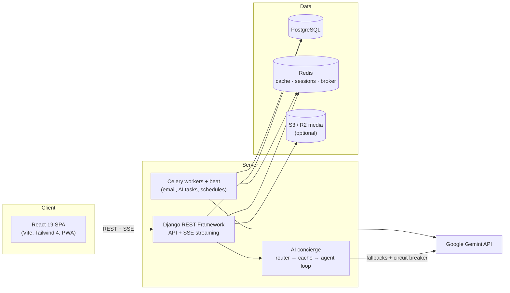

# ReNest

[](https://github.com/Divya1S/ReNest/actions/workflows/ci.yml)

ReNest is a campus move-out rescue marketplace. Students photograph their room, tag rescue-worthy items with hotspots, and turn a chaotic move-out into structured listings, donations, and coordinated pickups — so usable dorm gear stays on campus instead of going to the dumpster.

## Features

- **Room Rescue Scan** — upload room photos, tag items with hotspots (or let AI vision detect them), and generate structured listing drafts in bulk
- **Clear-Out Board** — triage every draft into sell / donate / keep / toss with keyboard shortcuts and bulk actions
- **Public marketplace** — browse without an account; reserve, save, and post with one; natural-language search ("free lamp near north dorms") with semantic ranking
- **Nest Concierge** — an AI assistant with tool access to live marketplace data: plans multi-step answers, streams progress over SSE, renders listing cards and action chips, and degrades gracefully when the AI provider is down or out of quota
- **Handoff Hub** — stage-driven pickup coordination: approve → schedule → PIN-verified handoff, with in-app chat, calendar export, and post-handoff feedback
- **Move-Out Plan** — auto-generated operational tasks with due windows tied to your move-out deadline
- **Trust Center** — feedback-driven trust badges, listing reports, moderation workflow, and dispute resolution
- **Rescue Requests** — a needs board that matches student requests against live listings
- **Donation hubs** — public hub directory with capacity tracking, one-click donation routing, and a manager dispatch console
- **Campus scale** — multi-campus scoping with email-domain auto-match, public campus pages, analytics dashboards, and CSV/PDF reporting
- **Live impact stats** — real rescue counts, retail value saved, and landfill diversion
- **PWA** — installable, offline fallback, and web push notifications

## Architecture



The AI concierge routes each message semantically (chat / help / task), serves repeat questions from an embedding cache, and runs task queries through a plan–execute–reflect loop over read-only marketplace tools. Every AI path fails open: circuit breakers, bounded retries, quota-aware model fallbacks, and offline golden-set evals in CI.

> Naming note: the Django project module is `dormcycle` (the product's original working title). Renaming a Django settings module is high-churn and low-value, so the module name stays; the product is ReNest.

## Tech stack

| Layer | Technology |
|---|---|
| Frontend | React 19, Vite, Tailwind CSS 4, framer-motion, TypeScript (strict on lib/pages) |
| Backend | Django 6, Django REST Framework, drf-spectacular (OpenAPI) |
| Data | PostgreSQL (SQLite fallback for zero-setup dev), Redis |
| Async | Celery workers + beat schedules (eager mode in dev — no broker needed) |
| AI | Google Gemini (chat, vision, embeddings) via `google-genai` |
| Testing | Django test runner, mypy, Vitest, ESLint, Playwright e2e |
| Deploy | Render blueprint (`render.yaml`), Docker Compose for local Postgres, WhiteNoise + uvicorn serving API and SPA same-origin |

## Project structure

```
backend/
  accounts/       auth, campuses, profiles, referrals
  listings/       marketplace core: listings, reservations, handoffs, scans, logistics
  hubs/           donation hub directory + manager tools
  concierge/      AI assistant: router, semantic cache, orchestrator, evals
  dormcycle/      Django project (settings, celery, urls, ASGI/WSGI)
frontend/
  src/            React app (pages, components, hooks, lib)
  e2e/            Playwright specs (mocked API — no backend needed)
docs/             deployment runbook, concierge architecture, mobile shell, roadmap
scripts/          render build, load test, backup/restore
```

## Run locally

Prerequisites: Python 3.13, Node 20+, Docker (optional, for Postgres).

1. Start PostgreSQL (or skip and use `USE_SQLITE=1` below):

```bash
docker compose up -d postgres
```

2. Configure the backend environment:

```bash
cd backend
cp .env.example .env   # then fill in values as needed
```

3. Install backend dependencies and run Django:

```bash
python -m venv ../.venv
../.venv/bin/pip install -r requirements.txt
../.venv/bin/python manage.py migrate
../.venv/bin/python manage.py seed_demo
../.venv/bin/python manage.py runserver 127.0.0.1:8000
```

4. Start the frontend:

```bash
cd frontend
npm install
npm run dev
```

Open `http://localhost:5173`. API docs (Swagger UI): `http://127.0.0.1:8000/api/docs/` · Health: `/api/health/live`, `/api/health/ready`.

**Zero-setup variant:** skip Docker and run every backend command prefixed with `USE_SQLITE=1`.

**AI features:** set `GEMINI_API_KEY` in `backend/.env` (free key at [aistudio.google.com](https://aistudio.google.com)) and restart the server. Everything works without it — AI surfaces simply switch off.

### Demo accounts

Created by `manage.py seed_demo`:

- `maya@renest.local` / `demo-pass-123`
- `leo@renest.local` / `demo-pass-123`

Log in as both (one in a private window) to exercise the full reserve → approve → chat → PIN handoff → feedback loop.

## Testing

```bash
# Backend: 200+ tests, whole-project type-check, offline AI evals
cd backend
../.venv/bin/python manage.py test
../.venv/bin/mypy .
../.venv/bin/python manage.py run_concierge_evals

# Frontend: unit, lint, types, build, e2e
cd frontend
npm test
npm run lint
npm run typecheck
npm run build
npm run e2e        # Playwright, fully mocked API — no backend needed
```

The same gates run in CI on every push (`.github/workflows/ci.yml`): a backend job, a frontend job, and a Playwright e2e job.

## Deployment

One-click deploy via the Render blueprint (`render.yaml`): Render Dashboard -> New -> Blueprint -> pick this repo. It provisions one free web service (uvicorn/ASGI serving the API and the built SPA same-origin) and a free PostgreSQL database.

### After the first deploy

1. Fill in the `sync: false` env vars in the Render dashboard. Everything is optional; each unset value only switches its own feature off:
   - `GEMINI_API_KEY` (free key at [aistudio.google.com](https://aistudio.google.com)) turns on the concierge, room-scan detection and AI copywriting.
   - `EMAIL_HOST` / `EMAIL_PORT` / `EMAIL_HOST_USER` / `EMAIL_HOST_PASSWORD` / `DEFAULT_FROM_EMAIL` enable password resets and handoff reminders. Any SMTP provider with a free tier works.
   - `AWS_S3_BUCKET_NAME` (+ `AWS_S3_ENDPOINT_URL` for Cloudflare R2) moves uploads off the container's ephemeral disk.
   - `VAPID_PUBLIC_KEY` / `VAPID_PRIVATE_KEY` enable web push (`npx web-push generate-vapid-keys`).
   - `SENTRY_DSN` / `VITE_SENTRY_DSN` enable error reporting.
2. Set up the scheduled jobs (see below). Without them nothing expires, no reminders go out, and saved-search alerts never fire.
3. Create an admin user: Render Shell -> `cd backend && python manage.py createsuperuser`.

### Free-tier constraints

| Constraint | Effect | Mitigation |
|---|---|---|
| Free web service sleeps after 15 min idle | First request after idle takes ~1 min | The maintenance cron pings it every 30 min |
| Free plan has no background workers | No Celery worker or beat; tasks run inline in the request | Scheduled jobs run via GitHub Actions cron (below) |
| Render's free Postgres expires 30 days after creation | Database becomes unreachable | Use a free-forever provider (Neon, Supabase): set `DATABASE_URL` on the web service and delete the `databases:` block from `render.yaml` |
| Ephemeral disk | Uploaded photos vanish on redeploy | Set `AWS_S3_BUCKET_NAME` (Cloudflare R2 has a free tier) |

To run real background workers later, uncomment the "Paid tier" block at the bottom of `render.yaml` and set `REDIS_URL`.

## Maintenance

The scheduled jobs (listing expiry, handoff reminders, saved-search alerts, trending cache, digests) run in one of three ways:

**1. GitHub Actions cron (default, free).** `.github/workflows/maintenance.yml` POSTs to a token-protected endpoint on a schedule. Configure once, under Settings -> Secrets and variables -> Actions:

- variable `MAINTENANCE_URL` = your deployment's base URL, e.g. `https://renest-web.onrender.com`
- secret `MAINTENANCE_TOKEN` = the same value as the `MAINTENANCE_TOKEN` env var on the server (the blueprint generates one)

Until both are set the workflow exits early without failing. Note that GitHub disables scheduled workflows on a public repository after 60 days with no commits.

**2. A cron entry or the Render shell**, running the same jobs in-process:

```bash
cd backend
python manage.py run_maintenance                 # every 15-30 min
python manage.py run_maintenance --jobs daily    # once a day
python manage.py run_maintenance --jobs weekly   # once a week
python manage.py createsuperuser                 # Django admin at /admin/
```

**3. Celery beat**, when `REDIS_URL` and a worker are configured. `CELERY_BEAT_SCHEDULE` in `dormcycle/settings.py` covers the same jobs; use this instead of the cron, not alongside it.

### Backups

`.github/workflows/backup.yml` runs a daily `pg_dump` and stores it as a workflow artifact with 7-day retention. Add a `DATABASE_URL` secret (or the discrete `POSTGRES_*` secrets) to enable it; it skips cleanly when unconfigured and fails loudly rather than uploading an empty dump.

Artifacts on a **public** repository are downloadable by anyone. Keep backups of real user data off a public repo: point the workflow at a private repository, or run `scripts/backup.sh` on a host you control.
