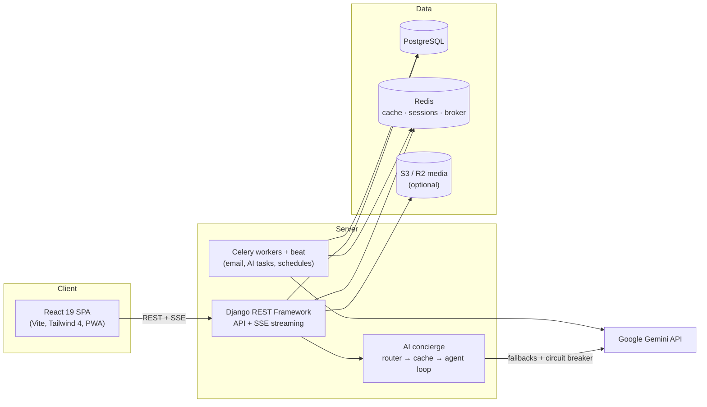
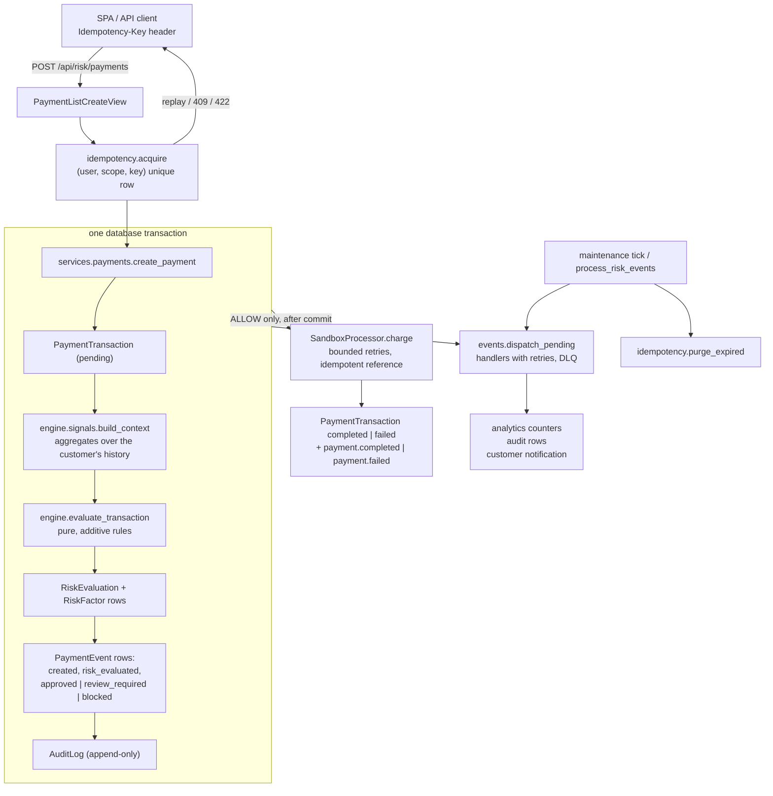

# ReNest

[](https://github.com/Divya1S/ReNest/actions/workflows/ci.yml)

ReNest is a campus move-out rescue marketplace. Students photograph their room, tag rescue-worthy items with hotspots, and turn a chaotic move-out into structured listings, donations, and coordinated pickups — so usable dorm gear stays on campus instead of going to the dumpster.

## Features

- **Room Rescue Scan** — upload room photos, tag items with hotspots (or let AI vision detect them), and generate structured listing drafts in bulk
- **Clear-Out Board** — triage every draft into sell / donate / keep / toss with keyboard shortcuts and bulk actions
- **Public marketplace** — browse without an account; reserve, save, and post with one; natural-language search ("free lamp near north dorms") with semantic ranking
- **Nest Concierge** — an AI assistant with tool access to live marketplace data: plans multi-step answers, streams progress over SSE, renders listing cards and action chips, and degrades gracefully when the AI provider is down or out of quota
- **Handoff Hub** — stage-driven pickup coordination: approve → schedule → PIN-verified handoff, with in-app chat, calendar export, and post-handoff feedback
- **Move-Out Plan** — auto-generated operational tasks with due windows tied to your move-out deadline
- **Trust Center** — feedback-driven trust badges, listing reports, moderation workflow, and dispute resolution
- **Rescue Requests** — a needs board that matches student requests against live listings
- **Donation hubs** — public hub directory with capacity tracking, one-click donation routing, and a manager dispatch console
- **Campus scale** — multi-campus scoping with email-domain auto-match, public campus pages, analytics dashboards, and CSV/PDF reporting
- **Live impact stats** — real rescue counts, retail value saved, and landfill diversion
- **PWA** — installable, offline fallback, and web push notifications
- **Risk Intelligence**: a sandbox payment pipeline with an explainable risk decision engine, idempotent payment API, append-only event log with retries and dead-lettering, a Fraud Lab that measures detection against friction on labelled synthetic attacks, a query-grounded Risk Investigator, and an agent spending-policy sandbox. See [ReNest Risk Intelligence](#renest-risk-intelligence).

## Architecture



The AI concierge routes each message semantically (chat / help / task), serves repeat questions from an embedding cache, and runs task queries through a plan–execute–reflect loop over read-only marketplace tools. Every AI path fails open: circuit breakers, bounded retries, quota-aware model fallbacks, and offline golden-set evals in CI.

> Naming note: the Django project module is `dormcycle` (the product's original working title). Renaming a Django settings module is high-churn and low-value, so the module name stays; the product is ReNest.

## Tech stack

| Layer | Technology |
|---|---|
| Frontend | React 19, Vite, Tailwind CSS 4, framer-motion, TypeScript (strict on lib/pages) |
| Backend | Django 6, Django REST Framework, drf-spectacular (OpenAPI) |
| Data | PostgreSQL (SQLite fallback for zero-setup dev), Redis |
| Async | Celery workers + beat schedules (eager mode in dev — no broker needed) |
| AI | Google Gemini (chat, vision, embeddings) via `google-genai` |
| Testing | Django test runner, mypy, Vitest, ESLint, Playwright e2e |
| Deploy | Render blueprint (`render.yaml`), Docker Compose for local Postgres, WhiteNoise + uvicorn serving API and SPA same-origin |

## Project structure

```
backend/
  accounts/       auth, campuses, profiles, referrals
  listings/       marketplace core: listings, reservations, handoffs, scans, logistics
  hubs/           donation hub directory + manager tools
  concierge/      AI assistant: router, semantic cache, orchestrator, evals
  risk/           Risk Intelligence: engine, payments, events, Fraud Lab, investigator, agents
  dormcycle/      Django project (settings, celery, urls, ASGI/WSGI)
frontend/
  src/            React app (pages, components, hooks, lib)
  e2e/            Playwright specs (mocked API — no backend needed)
scripts/          render build, load tests (marketplace and risk), backup/restore
```

## Run locally

Prerequisites: Python 3.13, Node 20+, Docker (optional, for Postgres).

1. Start PostgreSQL (or skip and use `USE_SQLITE=1` below):

```bash
docker compose up -d postgres
```

2. Configure the backend environment:

```bash
cd backend
cp .env.example .env   # then fill in values as needed
```

3. Install backend dependencies and run Django:

```bash
python -m venv ../.venv
../.venv/bin/pip install -r requirements.txt
../.venv/bin/python manage.py migrate
../.venv/bin/python manage.py seed_demo
../.venv/bin/python manage.py runserver 127.0.0.1:8000
```

4. Start the frontend:

```bash
cd frontend
npm install
npm run dev
```

Open `http://localhost:5173`. API docs (Swagger UI): `http://127.0.0.1:8000/api/docs/` · Health: `/api/health/live`, `/api/health/ready`.

**Zero-setup variant:** skip Docker and run every backend command prefixed with `USE_SQLITE=1`.

**AI features:** set `GEMINI_API_KEY` in `backend/.env` (free key at [aistudio.google.com](https://aistudio.google.com)) and restart the server. Everything works without it — AI surfaces simply switch off.

### Demo accounts

Created by `manage.py seed_demo`:

- `maya@renest.local` / `demo-pass-123`
- `leo@renest.local` / `demo-pass-123`

Log in as both (one in a private window) to exercise the full reserve → approve → chat → PIN handoff → feedback loop.

## Testing

```bash
# Backend: 350+ tests, whole-project type-check, offline AI evals
cd backend
../.venv/bin/python manage.py test
../.venv/bin/mypy .
../.venv/bin/python manage.py run_concierge_evals
../.venv/bin/pip-audit -r requirements.txt   # dependency vulnerability audit

# Frontend: unit, lint, types, build, e2e
cd frontend
npm test
npm run lint
npm run typecheck
npm run build
npm run e2e        # Playwright, fully mocked API — no backend needed
```

The same gates run in CI on every push (`.github/workflows/ci.yml`): a backend job, a frontend job, and a Playwright e2e job.

## Deployment

One-click deploy via the Render blueprint (`render.yaml`): Render Dashboard -> New -> Blueprint -> pick this repo. It provisions one free web service (uvicorn/ASGI serving the API and the built SPA same-origin) and a free PostgreSQL database.

### After the first deploy

1. Fill in the `sync: false` env vars in the Render dashboard. Everything is optional; each unset value only switches its own feature off:
   - `GEMINI_API_KEY` (free key at [aistudio.google.com](https://aistudio.google.com)) turns on the concierge, room-scan detection and AI copywriting.
   - `EMAIL_HOST` / `EMAIL_PORT` / `EMAIL_HOST_USER` / `EMAIL_HOST_PASSWORD` / `DEFAULT_FROM_EMAIL` enable password resets and handoff reminders. Any SMTP provider with a free tier works.
   - `AWS_S3_BUCKET_NAME` (+ `AWS_S3_ENDPOINT_URL` for Cloudflare R2) moves uploads off the container's ephemeral disk.
   - `VAPID_PUBLIC_KEY` / `VAPID_PRIVATE_KEY` enable web push (`npx web-push generate-vapid-keys`).
   - `SENTRY_DSN` / `VITE_SENTRY_DSN` enable error reporting.
2. Set up the scheduled jobs (see below). Without them nothing expires, no reminders go out, and saved-search alerts never fire.
3. Create an admin user: Render Shell -> `cd backend && python manage.py createsuperuser`.

### Free-tier constraints

| Constraint | Effect | Mitigation |
|---|---|---|
| Free web service sleeps after 15 min idle | First request after idle takes ~1 min | The maintenance cron pings it every 30 min |
| Free plan has no background workers | No Celery worker or beat; tasks run inline in the request | Scheduled jobs run via GitHub Actions cron (below) |
| Render's free Postgres expires 30 days after creation | Database becomes unreachable | Use a free-forever provider (Neon, Supabase): set `DATABASE_URL` on the web service and delete the `databases:` block from `render.yaml` |
| Ephemeral disk | Uploaded photos vanish on redeploy | Set `AWS_S3_BUCKET_NAME` (Cloudflare R2 has a free tier) |

To run real background workers later, uncomment the "Paid tier" block at the bottom of `render.yaml` and set `REDIS_URL`.

## Maintenance

The scheduled jobs (listing expiry, handoff reminders, saved-search alerts, trending cache, digests) run in one of three ways:

**1. GitHub Actions cron (default, free).** `.github/workflows/maintenance.yml` POSTs to a token-protected endpoint on a schedule. Configure once, under Settings -> Secrets and variables -> Actions:

- variable `MAINTENANCE_URL` = your deployment's base URL, e.g. `https://renest-web.onrender.com`
- secret `MAINTENANCE_TOKEN` = the same value as the `MAINTENANCE_TOKEN` env var on the server (the blueprint generates one)

Until both are set the workflow exits early without failing. Note that GitHub disables scheduled workflows on a public repository after 60 days with no commits.

**2. A cron entry or the Render shell**, running the same jobs in-process:

```bash
cd backend
python manage.py run_maintenance                 # every 15-30 min
python manage.py run_maintenance --jobs daily    # once a day
python manage.py run_maintenance --jobs weekly   # once a week
python manage.py createsuperuser                 # Django admin at /admin/
```

**3. Celery beat**, when `REDIS_URL` and a worker are configured. `CELERY_BEAT_SCHEDULE` in `dormcycle/settings.py` covers the same jobs; use this instead of the cron, not alongside it.

### Backups

`.github/workflows/backup.yml` runs a daily `pg_dump` and stores it as a workflow artifact with 7-day retention. Add a `DATABASE_URL` secret (or the discrete `POSTGRES_*` secrets) to enable it; it skips cleanly when unconfigured and fails loudly rather than uploading an empty dump.

Artifacts on a **public** repository are downloadable by anyone. Keep backups of real user data off a public repo: point the workflow at a private repository, or run `scripts/backup.sh` on a host you control.

## ReNest Risk Intelligence

A payments risk subsystem built into the marketplace: sandbox payments, an explainable decision engine, a Fraud Lab, an investigator, and an agent spending sandbox. No real money moves anywhere in it. The route is `/risk` in the app and `/api/risk/` on the API.

### Problem

A campus marketplace handles small payments from young accounts on shared Wi-Fi, which is exactly the traffic that card testers, account-takeover rings and multi-account promo abusers hide inside. The interesting engineering problems are not "detect fraud" in the abstract but: decide in milliseconds with an explanation a human can read, never charge twice when a client retries, never lose a downstream side effect, keep an audit trail that cannot be edited, and measure the trade-off between catching fraud and annoying honest students instead of guessing at it.

### Product

| Page | What it shows |
|---|---|
| Risk Overview (`/risk`) | Counts, block and review rates, amounts declined or held, LOW/MEDIUM/HIGH distribution, decision series, evaluation latency P50/P95/P99, the sensitivity slider, a live feed, and a form to create sandbox payments through the real pipeline |
| Transaction Explorer (`/risk/transactions`) | Search and filters (decision, status, band, simulated rows) over every payment |
| Transaction Investigation (`/risk/transactions/:id`) | Score against the thresholds, signed risk factors, the engine's explanation text, the frozen signal snapshot, the event timeline and the audit trail; staff can resolve a held payment |
| Fraud Lab (`/risk/lab`) | Eight labelled scenarios scored by the live engine, with measured precision, recall, false positive rate, protected and held amounts, latency, a detection-versus-friction sweep and a re-threshold slider |
| Risk Investigator (`/risk/investigator`) | Plain-language questions answered from a fixed query set, with facts, inferences and evidence separated |
| Agent Sandbox (`/risk/agents`) | Spending policies for autonomous agents and an explainable verdict for every attempt |
| System Health (`/risk/health`) | Request and error counters, decision counters, latency percentiles, event queue depth, dead letters with replay, idempotency key counts |

Every number on these pages is counted from stored rows or from the metrics reservoir. Synthetic rows are flagged `is_simulation` and are excluded from real profiles and dashboards unless you ask for them, in which case they are labelled.

### Architecture



The whole thing runs on the existing stack (Django, DRF, the configured cache, the maintenance tick). There is no broker: the `PaymentEvent` table is the log, and the same code path dispatches inline after commit, from the scheduled tick, or from a dedicated worker command.

### Risk engine

`risk.engine.evaluate_transaction(context, sensitivity=50)` is a pure function of a frozen `TransactionContext` and returns:

```python
RiskDecision(
    decision="block",              # allow | review | block
    risk_score=74,                 # 0..100, additive, clamped
    confidence=0.83,               # heuristic 0.50..0.99, documented as uncalibrated
    reasons=["amount_vs_history", "new_device", "ip_churn", "unusual_hour"],
    factors=[RuleResult(code, points, label, detail), ...],
    thresholds=Thresholds(sensitivity=50, review=40, block=70),
    model_version="risk-rules-v1",
    evaluation_time_ms=0.031,      # measured with perf_counter around the call
    explanation="RISK SCORE: 74 / 100\n+34 ...",
)
```

Rules live in `risk/engine/rules.py`, one class each, registered in a tuple; adding a signal means adding one class. Points are signed so trust reduces the score. The current model, hand-tuned and documented as a demonstration model, not a trained one:

| Signal | Points | Fires when |
|---|---|---|
| Amount versus history | +12 / +22 / +34 | 2x / 3x / 6x the customer's average, with at least three prior payments |
| Large first transaction | +10 / +18 | No history and amount at least 200 / 1,000 |
| Extreme amount | +12 / +35 | Amount at least 1,000 / 2,000 |
| New device | +21 | Established account on a device it never used |
| Known device | -12 | Device used three or more times before |
| Device shared by accounts | +24 | Three or more accounts on one device in 24h |
| Device churn | +16 | Three or more devices in 24h |
| Network churn | +15 | Four or more network prefixes in 24h |
| Hourly velocity | +18 / +30 | 3 / 5 or more payments in the last hour |
| Daily velocity | +10 / +20 | 8 / 15 or more payments in 24h |
| Card testing | +28 | Amount under 5 and four or more payments in the hour |
| Account age | +18 / +11 / +5 / -6 | Under 1 day / 7 days / 30 days; 180 days or more |
| Failed attempts | +7 / +20 | 1 / 3 or more failed or blocked payments in 24h |
| Trusted customer | -8 / -15 | 3 / 10 or more successful payments and no recent failure |
| Currency mismatch | +8 | First payment in a currency the account never used |
| Unusual hour | +4 | 01:00 to 05:00 in the campus time zone |
| New merchant, large amount | +6 | First time at a merchant and 2x the average |

Thresholds come from one 0..100 sensitivity: `review = 60 - 0.4 * s`, `block = 90 - 0.4 * s`. Both lines have the same slope, so the review band is always 30 points wide and raising sensitivity never collapses REVIEW into BLOCK. Because scores do not depend on sensitivity, a sweep over stored scores is a pure re-threshold (`engine.rescore`), which is what makes the Fraud Lab slider instant.

Signals for real payments come from `risk/engine/signals.py`: a fixed number of aggregate queries over the customer's non-simulated history (no per-row loops), so evaluation cost does not grow with history. Only a coarse network prefix (first two octets) is ever stored, never a full IP address.

### Explainability

The explanation is generated from the same `RuleResult` list that produced the score, so it cannot disagree with the number (a test asserts this). Every factor carries a stable code, its points, a label and the figures behind it; the transaction page lists them strongest first and shows the frozen context snapshot the engine saw, so any decision can be replayed later. The "confidence" value is a heuristic built from evidence coverage and distance to the nearest threshold; it is labelled as such in the API and the UI and is not a probability.

### Fraud Lab

`risk/services/simulation.py` generates labelled synthetic transactions for eight scenarios: normal customer traffic (no fraud; measures friction), card testing, account takeover, new device attack, high velocity, suspicious amount, coordinated fraud and multiple-account abuse. Each row is pushed through the same `evaluate_transaction` that live payments use, and every metric is counted from what the engine actually decided:

- analyzed, allowed, reviewed, blocked; labelled fraud and legitimate counts
- `precision_flagged = fraud (review or block) / all (review or block)`, `recall_flagged = fraud (review or block) / all fraud`, and the same pair for blocks only
- `false_positive_rate = legitimate (review or block) / all legitimate`
- amount of labelled fraud blocked outright, held for review, and legitimate spend slowed down
- LOW/MEDIUM/HIGH bands, the most frequent factors in fraud versus legitimate rows, measured engine latency (avg, P50, P95, P99) and the whole-run duration
- a sweep of detection rate against friction rate at every sensitivity from 0 to 100

Precision and recall are only reported because synthetic labels exist; the API never reports them for real traffic. Legitimate rows deliberately include ordinary quirks (a new phone, a big textbook order, a late-night purchase, one failed card) so false positives are possible and the friction curve is honest. Runs are seeded and reproducible; each account keeps its last six runs and their rows.

### Idempotency

`POST /api/risk/payments` accepts an `Idempotency-Key` header (up to 255 characters). Keys are scoped to `(user, endpoint)` and stored with the SHA-256 of the canonical request body; the unique constraint on that row is the only lock. Documented behaviour, all covered by tests in `risk/tests/test_idempotency.py`:

| Situation | Response |
|---|---|
| Same key, same body, original finished | The stored response replayed verbatim with `Idempotent-Replayed: true`; no second payment |
| Same key after the server crashed once the payment was committed | The key was bound to the payment before the processor call, so the retry replays it; still one payment |
| Same key, different body | `422 idempotency_key_reused`; nothing is created |
| Same key while the original is still running | `409 idempotency_in_progress` with `Retry-After: 1`; the retry replays once the original completes |
| Key older than 24 hours | Treated as new; a fresh payment is created (the window is part of the contract) |
| Validation failure | The 400 is stored and replayed too, so a retry of a bad request gets the same answer |
| Unexpected server error | The key is released so the client's retry gets a real attempt instead of a cached failure |

The processor call is idempotent on the transaction's public id as well, so a crash between "charged" and "recorded" is safe to retry.

### Event architecture

Events: `payment.created`, `payment.risk_evaluated`, `payment.approved`, `payment.review_required`, `payment.blocked`, `payment.completed`, `payment.failed`, `payment.reviewed`, `risk.policy_updated`, `agent.decision`. Each row carries `event_id` (ULID-style), `sequence`, `event_type`, `schema_version`, `entity_type`, `entity_id`, `payload`, `request_id`, `occurred_at`, and its processing state.

Assumptions, stated rather than implied:

- Emission happens inside the caller's database transaction, so an event exists if and only if the state change committed. Dispatch is scheduled with `transaction.on_commit`.
- Delivery is at least once. A crash between "handler ran" and "processed_handlers saved" replays the handler, so every handler is idempotent (keyed on `event_id`).
- Ordering is guaranteed per entity by `sequence`, not globally.
- Several dispatchers may run at once (the request's post-commit hook, the maintenance tick, a worker). A dispatcher claims rows with one conditional UPDATE that stamps its token and a 60-second lease, and processes only the rows that UPDATE touched, so two dispatchers never own the same event on any database. A dispatcher that dies leaves rows whose lease expires, after which they are claimable again.
- A request dispatches only the events it emitted; the backlog (retries, dead-letter candidates) belongs to the tick and the worker, so a broken handler cannot slow every checkout.

### Reliability

- The sandbox processor is charged with bounded retries and exponential backoff with jitter (`risk/services/retry.py`); transient errors retry, permanent declines do not. `sandbox_behavior` on the request (`succeed`, `fail_transient_once`, `fail_transient`, `decline`) plays the role of test-card numbers so every path is demonstrable.
- Event handlers get three inline retries; the event itself gets five dispatch attempts with backoff of 5, 30, 120 and 600 seconds, then moves to `dead`. Dead letters are visible on System Health and can be replayed by staff. Nothing is dropped silently.
- The processor is called after the database transaction commits, never inside it. Before that call the idempotency key is already bound to the committed payment, so a crash during capture makes the client's retry replay the same payment instead of creating another.
- Payments that were approved but never reached a terminal state (a process died mid-capture) are re-driven by a reconciler after five minutes; the processor reference is the transaction id, so a repeat charge is a no-op.
- `manage.py process_risk_events --loop 5` runs a dedicated dispatcher; the maintenance tick does the same work plus idempotency-key purging and reconciliation.

### Security

- Session authentication with CSRF on every write; every endpoint requires a signed-in user. Non-staff see only their own payments, simulations, investigations, agents, events and audit rows (`ScopedQuerySet.for_user`); staff-only actions are policy changes, manual review, event replay and the Prometheus endpoint.
- Strict input validation: positive amounts with a hard ceiling, supported currencies with zero-decimal handling for JPY, bounded metadata (20 keys, 2 KB), enumerated payment methods and sandbox behaviours, capped query parameters and page sizes, JSON-only bodies.
- Metadata is redacted at the API boundary and again before audit rows are written: keys such as `password`, `token`, `card_number`, `pan`, `cvv` never reach the database or the logs. Only a coarse network prefix is stored.
- Audit rows are append-only by construction: the model refuses updates and deletes, and the queryset refuses bulk deletes.
- Customers see that a manual review happened and its outcome; the reviewer's identity and notes are visible to staff only. Fraud Lab rows can never be reviewed or captured.
- Per-user write throttles on payments, simulations, investigations and agent attempts; the agent count per account is capped.
- The investigator never sends free-form user text to a model as an instruction; the optional narrator receives only the structured facts, and an answer that mentions a number absent from those facts is discarded.

### AI investigator

`risk/services/investigator.py` is a controlled pipeline: a deterministic classifier maps the question to one of seven intents and a time window; each intent has a fixed plan of allowed queries (decision counts with a previous-period comparison, top factors behind blocks, new-device transactions, the review queue, velocity and device-sharing patterns, highest-risk transactions); the structured results are turned into an answer whose sentences are split into facts (each one maps to a number in the results) and inferences (labelled possibilities), with the transaction ids that back them as evidence. The queries that ran are stored with every investigation.

Explanation providers sit behind a small Protocol. `DeterministicExplainer` is the default and the mode used in tests. `GeminiExplainer` reuses the marketplace's existing Gemini client (free tier) when `RISK_INVESTIGATOR_MODE=auto` or `llm` and a key is configured; it may only narrate the facts it is given, falls back to the deterministic answer on any provider failure, and is rejected if it invents a number. Without a key nothing costs money and everything still answers.

### Agent payment sandbox

An `AgentPolicy` has `dailyLimit`, `transactionLimit`, `requiresApprovalAbove`, `allowedCategories`, `blockedMerchants` and a currency. Every attempt runs the checks in order and records a structured reason for each: policy active, positive amount in the policy currency, merchant not blocked, category allowed, per-transaction limit, daily limit against today's counted spend, the risk engine (the owner is the account, the agent is the device), and finally the approval threshold, which downgrades to REVIEW. Approved and held attempts count toward the daily budget; blocked ones never do. Every attempt is audited and emits `agent.decision`.

### Performance (measured)

Produced by `scripts/risk_loadtest.py` against the development server on a laptop, so treat these as the shape of the system rather than a benchmark: SQLite serialises writes, `runserver` is single-process, and event handlers run inline after commit in this configuration. Rerun the script for your own numbers.

Machine: Apple Silicon laptop (macOS 15.7, Python 3.13), `manage.py runserver` with `USE_SQLITE=1`, 2026-09-09. Payments were spread over a pool of eight established sandbox customers (`manage.py risk_loadtest_users`), so the mix was 479 allowed and 1 held for review; all allowed payments went through the sandbox processor capture.

| Operation | Sessions | n | Error rate | Avg | P50 | P95 | P99 | Throughput |
|---|---|---|---|---|---|---|---|---|
| Payment creation over HTTP (idempotency, evaluation, events, audit, sandbox capture) | 8 concurrent | 480 | 0.0% | 144.4 ms | 61.9 ms | 624.1 ms | 1329.5 ms | 51.0 req/s |
| Payment creation over HTTP | 2 concurrent | 200 | 0.0% | 29.6 ms | 20.4 ms | 108.2 ms | 198.5 ms | 58.2 req/s |
| Risk evaluation, engine only (server-measured per call) | 8 concurrent | 480 | 0.0% | 0.020 ms | 0.020 ms | 0.030 ms | 0.030 ms | n/a |
| Transaction lookup over HTTP (detail with factors, events, audit) | 8 concurrent | 480 | 0.0% | 34.8 ms | 33.3 ms | 50.4 ms | 77.4 ms | 227.7 req/s |
| Transaction lookup over HTTP | 2 concurrent | 200 | 0.0% | 8.0 ms | 7.7 ms | 10.0 ms | 10.9 ms | 250.2 req/s |
| Fraud Lab run, 1,000 transactions over HTTP (score, persist, sweep) | 1 | 3 | 0.0% | 273.6 ms | 273.6 ms | 279.0 ms | 279.5 ms | 3.7 runs/s |
| Fraud Lab run, 1,000 transactions, server-measured | 1 | 3 | 0.0% | 269.3 ms | 268.9 ms | 275.2 ms | 275.7 ms | n/a |

The gap between the two concurrency levels is SQLite's single writer: eight sessions writing at once queue on the database lock, which is where the P95 and P99 come from. PostgreSQL removes that serialisation; the script accepts `--base-url` so the same measurement can be taken against a deployed instance.

The engine itself evaluates a transaction in well under a millisecond (measured per call with `perf_counter`, stored on every evaluation and summarised on System Health). Most of the request time is database writes: a payment creates one transaction row, one evaluation, its factors, three or four events, an audit row and the idempotency record, then the processor call and the completion event.

### Tradeoffs

- **Rules, not a model.** An additive rule set is legible and testable and the point values are documented; it is not calibrated on real fraud. The engine keys explanations on factor codes so a trained model could replace `rules.py` behind the same `RuleResult` shape.
- **Table-as-log instead of a broker.** Right for one service on a free tier and it keeps events transactional with the state change. It does not fan out across services and dispatch adds latency to the request when no scheduler is running.
- **Inline dispatch.** A request runs the handlers for its own events after commit, which makes demos self-contained but adds their cost to the request; a deployment with `process_risk_events` running could leave all dispatch to the worker.
- **Cache-backed counters.** Request, error and decision counters and the latency reservoirs live in the configured cache: shared and durable with Redis, per-process and reset on restart with the in-memory cache. Database figures on the same page are exact.
- **Simulations write real rows.** Each 1,000-row run persists transactions, evaluations and factors so they can be explored; retention is capped per account.
- **Synthetic labels only.** Precision and recall are reported for Fraud Lab data and nowhere else. Real traffic has no ground truth here and the UI says so.

### Local setup and demo script

```bash
cd backend
USE_SQLITE=1 ../.venv/bin/python manage.py migrate
USE_SQLITE=1 ../.venv/bin/python manage.py seed_demo            # marketplace demo accounts
USE_SQLITE=1 ../.venv/bin/python manage.py seed_risk_demo --email maya@renest.local
USE_SQLITE=1 ../.venv/bin/python manage.py runserver 127.0.0.1:8000
# optional: a dedicated event dispatcher
USE_SQLITE=1 ../.venv/bin/python manage.py process_risk_events --loop 5
```

Sign in as `maya@renest.local` (or promote a user to staff with `manage.py createsuperuser` to change the live policy and resolve held payments), then:

1. Open `/risk`. The seed created ordinary payments plus a large purchase, a new-device purchase, a card-testing burst and a processor decline, so the cards and the feed are populated.
2. Submit a sandbox payment from the form with `Processor behaviour: Transient failure, then succeed`; open it from the feed to see the retry recorded on the event timeline.
3. Open `/risk/lab`, run Account takeover at 1,000 transactions, then drag the re-threshold slider and watch blocked, reviewed, recall and false positives move.
4. Open `/risk/investigator` and ask "Why did blocked transactions increase today?".
5. Open `/risk/agents`, pick the seeded agent and attempt a 75.00 purchase in `electronics`; read the reasons.
6. Open `/risk/health` for counters, percentiles and the event queue. `GET /api/risk/metrics/prometheus` (staff) exposes the same numbers in Prometheus text format.

Replay a request with the same `Idempotency-Key` to see `Idempotent-Replayed: true`:

```bash
curl -s -X POST http://127.0.0.1:8000/api/risk/payments \
  -H 'Content-Type: application/json' -H 'X-CSRFToken: <token>' -H 'Idempotency-Key: order-42' \
  -b '<session cookie>' -d '{"merchant_id":"mkt_textbooks","amount":"42.50","currency":"USD","payment_method":"card","device_id":"laptop"}' -i
```

API reference (all under `/api/risk/`, all authenticated): `payments` (GET list, POST create), `payments/<id>`, `payments/<id>/review` (staff), `overview`, `feed`, `distribution`, `policy` (GET; PUT staff), `rules`, `health`, `metrics`, `metrics/prometheus` (staff), `scenarios`, `simulations` (GET, POST), `simulations/<id>`, `simulations/<id>/rescore?sensitivity=`, `investigator`, `investigations` (GET, POST), `investigations/<id>`, `agents` (GET, POST), `agents/<id>` (GET, PATCH), `agents/<id>/transactions` (GET, POST), `events`, `events/dispatch` (staff), `events/<id>/replay` (staff), `audit`. The OpenAPI schema at `/api/docs/` includes them.

Tests: `manage.py test risk` runs the engine, idempotency, event, payment API, simulation, investigator, agent, reliability and security suites; the frontend pages have Vitest tests with axe checks and a Playwright spec (`e2e/risk-intelligence.spec.js`).
